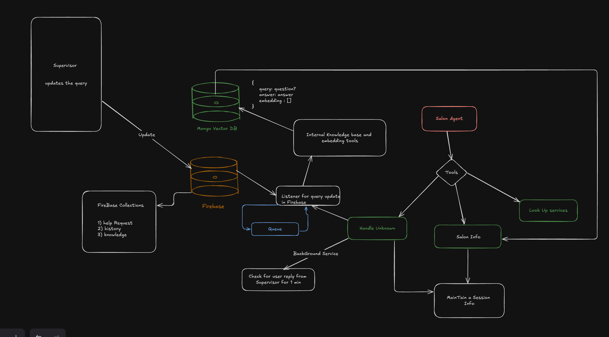
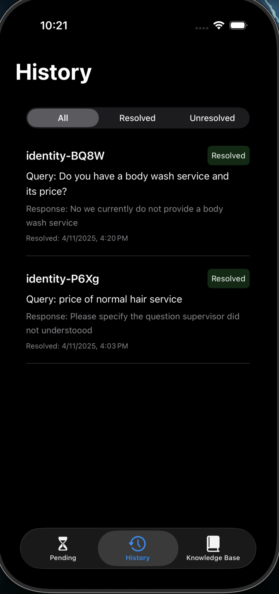
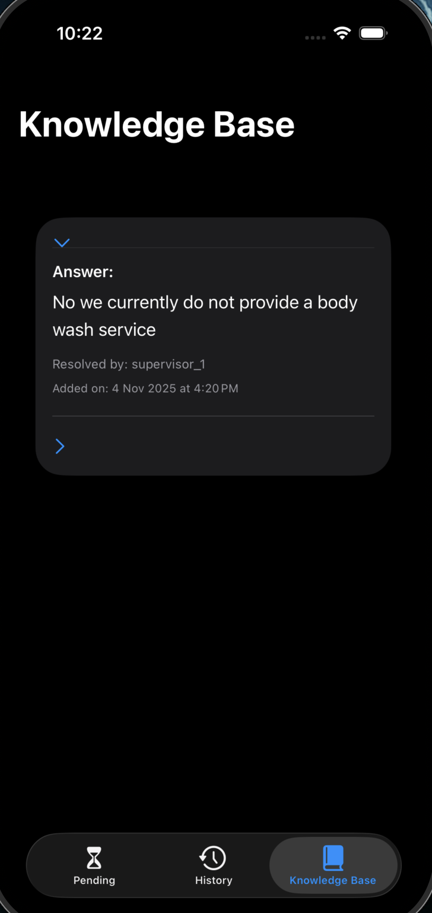

# Luna Glow Salon the AI Receptionist

### Built by [Amritesh Kumar]()
### [Video Link](https://drive.google.com/file/d/1_99YnxIzwBsrd0pzsEaDy64tJArlkKHx/view?usp=sharing)

---
## Setup 
**Clone the `git clone https://github.com/AMRITESH240304/Luna-Glow-Salon`**

**backend setup**
`cd backend`
`uv sync`
`uv run python src/agent.py console`

**Frontend Setup**
`cd frontdesk` `xed .` `cmd + r`

---

## Design

### Workflow Overview 
Salon Agent is built using **LiveKit Agents**, combining:
- **Voice interaction** for natural conversations
- **Real-time event handling** to manage live salon operations
## Available Tools

| Tool | Purpose |
|------|----------|
| `lookup_service_price` | Handles pricing and known salon services (e.g., haircut, manicure). |
| `salon_info` | Ability to use the Knowledge base for the know query and answer them. |
| `handle_unknown` | Escalates any uncertain or unseen question to a human supervisor for intervention. |

## Escalation Lifecycle (Handle Unknown Flow)

When Agent encounters a query she cannot answer confidently, initiates the **Handle Unknown** flow.

### Steps:

1. A new help request is created in **Firebase Firestore** → collection **`help_requests`**.  
2. It includes the user query, user ID, timestamp, and sets the status to **"pending"**.  
3. A background timeout task starts (**async**) that monitors this request for **60 seconds**.  
4. If no supervisor responds within that time the request automatically moves to the **history** collection as **"unresolved"**.

## Background Services

The background services make the system **reactive** and fully **asynchronous**.

---

### a. Firestore Listener (Threaded Watcher)

- Runs inside a dedicated thread using Firestore’s real-time `on_snapshot()` method.  
- Listens for any new supervisor responses in the **history** collection.  
- When a document is updated (i.e., a query is resolved), the listener:
  - Reads the response message.  
  - Pushes it into a **thread-safe Queue**.

---

### b. Async Queue Consumer

- Runs inside the **LiveKit async loop**.  
- Continuously checks the Queue for any new messages.  
- When a message arrives:
  - Sends the supervisor’s response back to the same user session.  
  - Stores the Q&A pair into the **MongoDB Vector Database** for future learning.  
  - Marks the Firebase record as **resolved**.

---

### c. Timeout Watcher

- For every help request, an async task is created.  
- It sleeps for **60 seconds** and checks if the query was resolved.  
- If not, the query moves to the **history** collection with `"status": "unresolved"`.

---

## 4. Databases and Roles

| Database | Role |
|-----------|------|
| **Firebase Firestore** | Handles help requests, supervisor updates, and query lifecycle. |
| **MongoDB Vector DB** | Stores long-term Q&A embeddings for the salon’s knowledge base. |
| **Queue (Thread-safe)** | Acts as a bridge between the Firestore listener thread and the main LiveKit async loop. |

## 5. End-to-End Flow Summary

**User → AI Agent → Tools**

1. **Unknown Query** → A new help request is created in **Firestore** with status **"pending"**.  
2. **Supervisor Updates** → The **Firestore Listener** detects the update and pushes it into the **Queue**.  
3. **Queue Consumer** → The message is read and **AI replies instantly** to the user.  
4. **MongoDB Vector DB** → Stores the new Q&A pair as long-term knowledge.  
5. **Timeout Watcher** → Moves any unanswered queries to the **"unresolved"** state in Firestore.

## Scope of Improvement

### Multi-Agent Hierarchy
Currently, a single agent manages all three tools:
- `lookup_service_price`
- `salon_info`
- `handle_unknown`

### Threading Bottleneck
Each user session currently spawns a dedicated thread to listen for supervisor responses through Firestore snapshots.

- Replace Firestore `on_snapshot` (thread-based) with **Google Pub/Sub** event-driven notifications.
- Run a single event loop to handle async updates using `asyncio.create_task()`.

## Frontend to handle Supervisor

